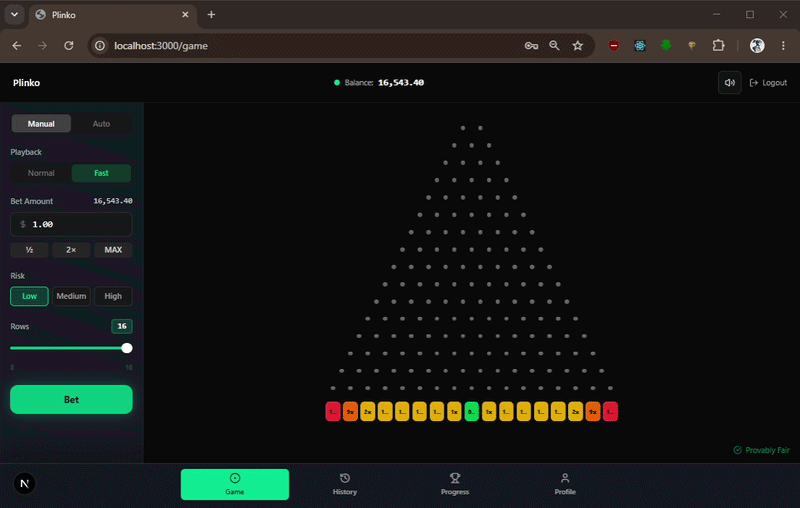

# Plinko

Browser-based Plinko game frontend built with Next.js.

The project focuses on a polished MVP gameplay experience: deterministic Plinko
board playback, Manual and Auto betting flows, Fast result mode, responsive
desktop/mobile UI, Profile and Progression pages, and restrained iGaming-style
audio feedback.



> Demo GIF should be placed at `public/showcase.gif`.

## Features

- Manual betting flow with selectable bet amount, risk, rows, and playback mode.
- Fast / no-animation result mode for quick bet resolution.
- Auto Mode with number of bets, stop-on-profit, and stop-on-loss controls.
- Deterministic Plinko visual playback based on backend result data.
- Responsive desktop and mobile layouts.
- Mobile HUD optimized for compact gameplay interaction.
- Profile page with user summary, nickname update, and avatar upload.
- Progression page with daily reward and mission claim flows.
- Restrained gameplay audio with a header `AudioToggle`.
- Backend-for-Frontend boundary through local `/api/*` routes.

## Tech Stack

- Next.js 16
- React 19
- TypeScript
- Tailwind CSS 4
- Zustand
- TanStack Query
- Howler
- pnpm

## Getting Started

### 1. Install dependencies

```bash
pnpm install
```

### 2. Configure environment variables

There is no tracked `.env.example` file yet. Create `.env.local` in the project
root:

```env
API_BASE=https://plinko-be-stanish.fly.dev
```

`API_BASE` is required by `src/shared/server/env.ts` and is used server-side by
local `/api/*` routes. Browser code should not call the backend directly.

### 3. Run the development server

```bash
pnpm dev
```

Open the local app in the browser:

```txt
http://localhost:3000
```

### 4. Build for production

```bash
pnpm build
```

### 5. Run lint

```bash
pnpm lint
```

## Validation Scripts

The repository also includes validation scripts used during development:

```bash
scripts/check-api-boundary.sh
scripts/check-docs-freshness.sh
scripts/validate.sh
```

On Windows, run shell scripts through Git Bash if plain `bash` resolves to WSL
without an installed distro:

```bash
"C:\Program Files\Git\bin\bash.exe" scripts/validate.sh
```

## Project Notes

- Browser requests go through local `/api/*` BFF routes.
- The backend API is accessed server-side through `API_BASE`.
- Auth tokens are stored in httpOnly cookies.
- Monetary values are handled as strings where applicable.
- Gameplay visual playback is based on backend-provided result data.
- Audio uses bundled MP3 assets from `public/sounds`.
- Peg/contact sounds are intentionally excluded from the MVP to avoid audio spam.
- The project is an internship/MVP frontend project and is not a production
  gambling product.

## Core Gameplay Modes

### Manual Mode

Manual mode lets the user place individual bets and watch the result through
normal visual playback or Fast mode.

### Fast Mode

Fast mode skips full board animation and reveals the result quickly while
preserving the same backend-driven result flow.

### Auto Mode

Auto Mode runs sequential bets with configurable stop conditions. Audio feedback
is intentionally restrained to avoid repetitive sound spam.

## Audio

The game includes a compact header `AudioToggle` and a small Howler-based audio
layer.

Audio events include:

- bet start;
- ball drop / landing feedback;
- loss result;
- win result;
- high-win result;
- Auto start;
- Auto stop;
- mute / unmute feedback.

No peg/contact sound is included in the MVP by design.

## Repository Status

This repository represents the frontend MVP state of the Plinko project,
including:

- core gameplay;
- protected app shell;
- profile page;
- progression page;
- Auto Mode;
- Fast playback;
- deterministic visual renderer;
- restrained gameplay audio.
